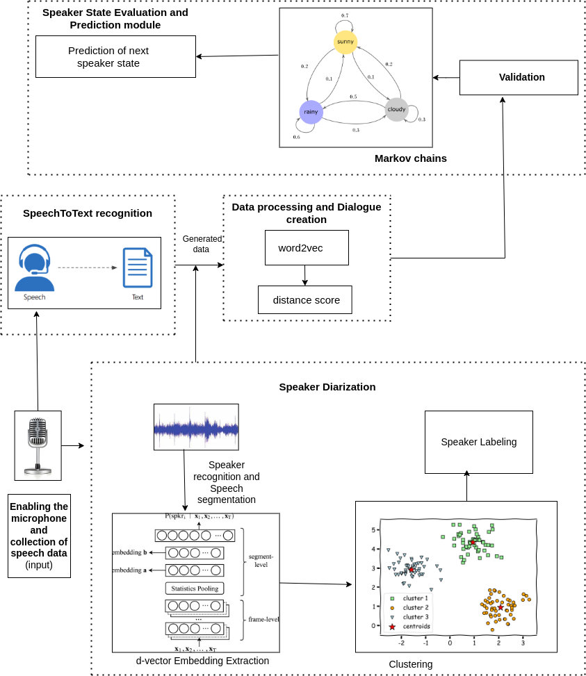

# Conversation_State_Prediction_System

This project aims to develop the conversation state prediction system on the basis of live conversational audio data and the extracted context.

Refer to the Project Report file "ProjectReport_.pdf" to understand the concepts and the system.

Architecture:

